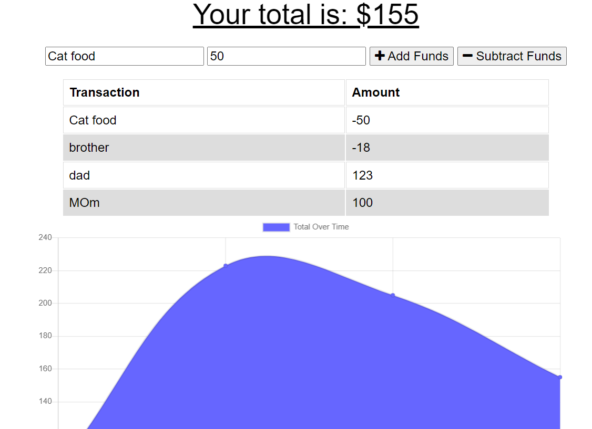

  
  # <h1 align="center"> 🌻 PWA-Budgeting 🌻 <h1>
  
----

## Table of Contents
- [Description](#description)
- [Installation](#installation)
- [Usage](#usage)
- [Contribution](#contribution)
- [Test Instructions](#test-instructions)
- [Questions](#questions)

----

### Description
For this project I built upon some starter code that was provided to create an appication that would still function while service and wifi is offline. This is a PWA (Progressive Web Application) and it allows for the user to deposit and withdraw money and the total will update automatically, as well as time stamp and graph your money flow. This application can be clones and ran on localhose:3001, or you can follow the deployed Heroku link.

----
### Installation
🔧Node.js, Compression, Express, MongoDb,Mongoose,Morgan, Nodemon

----
### Usage
✏️For all your budgeting needs, online and offline

----
### License
✅
This application is covered by the GNU AGPLv3,MIT License license.
----

### Contributing
🤝Amina Kurdi

----
### Test-Instructions
N.A

----
### Questions
💻Find me on GitHub: [Github Profile](https://github.com/Kurdiamina3)
 
📧Email me with any questions: kurdiamina3@gmail.com 
 

🌟_This README was generated with 💓 by [README-generator] (https://github.com/kurdiamina3/README-generator)🌟
